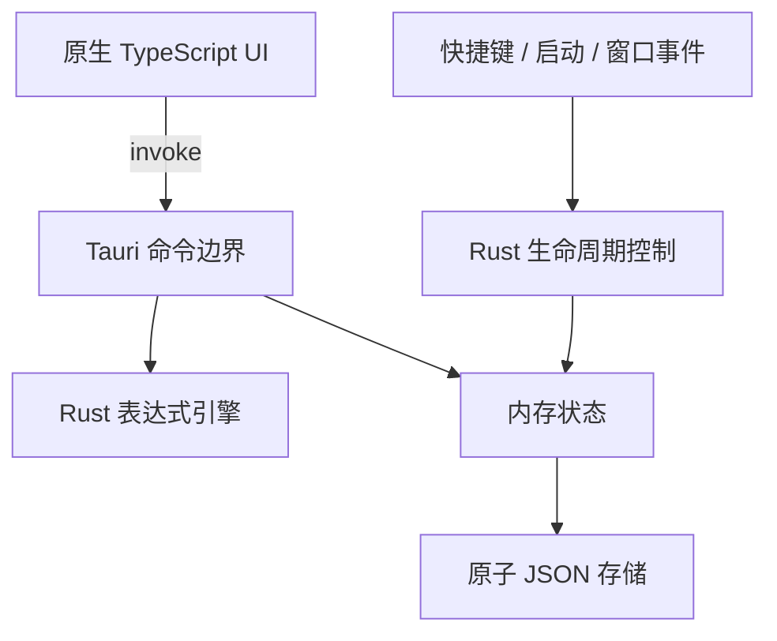

# QuickCalc 架构说明

## 1. 总览

QuickCalc 使用 Tauri 2 的单原生进程 + 单系统 WebView 模型。TypeScript 只负责输入、展示和快捷交互；求值、状态、持久化、全局快捷键、自启动与窗口生命周期由 Rust 负责。



## 2. 模块职责

| 路径 | 职责 |
| --- | --- |
| `src/main.ts` | 输入状态机、双 Enter 交互、历史渲染、剪贴板与焦点事件 |
| `src/brackets.ts` | 成对括号插入、跳过已有右括号、末尾括号补齐 |
| `src/input-normalization.ts` | 中文/全角数字、括号、标点和数学符号的前端即时转换 |
| `src/commands.ts` | 斜杠命令注册、解析、帮助以及 `/plugin` 管理命令 |
| `src/plugins.ts` | 插件清单、激活/停用生命周期与插件命令自动注销 |
| `src-tauri/src/evaluator.rs` | 词法分析、优先级解析、函数、变量、位运算和进制格式化 |
| `src-tauri/src/model.rs` | IPC 与持久化数据结构 |
| `src-tauri/src/storage.rs` | JSON 加载、备份恢复与同步原子替换 |
| `src-tauri/src/app_state.rs` | 线程安全设置和运行状态 |
| `src-tauri/src/commands.rs` | 最小化的前后端命令边界 |
| `src-tauri/src/lib.rs` | 插件初始化、全局快捷键、窗口与应用生命周期 |

## 3. 求值管线

1. 前端在输入法组合完成、粘贴和提交时将中文/全角表达式转为半角形式，再补齐末尾缺失的括号。
2. Rust 对全角字符、Unicode 运算符和多种括号执行同样的兜底归一化。
3. 在顶层识别可选赋值与末尾 `.bin|.oct|.dec|.hex` 输出格式；最后一个进制后缀不会与十进制小数点混淆。
4. tokenizer 只生成白名单 token，绝不调用 JavaScript `eval` 或系统 shell。
5. 递归下降解析器按固定优先级求值。
6. 校验结果为有限数值；位运算额外校验 `i64` 约束。
7. 更新变量、`res` 与历史记录，裁剪到 50 条。
8. 同步持久化成功后返回 IPC 响应。

以 `/` 开头的输入走独立的前端命令管线，不进入上述求值和持久化流程。插件通过 `PluginManager` 获得受控的命令注册函数；停用插件会清理其注册的全部命令。

此顺序使“界面已经显示成功，但历史尚未写盘”的窗口尽可能小。为了进一步保证数据库级事务语义，未来可把两个 JSON 文件合并为单一日志或迁移到 SQLite；当前单文件运行状态已经覆盖一次计算的原子性。

## 4. 持久化策略

Tauri 通过 bundle identifier `com.ykzstudio.quickcalc` 解析平台应用数据目录。文件布局：

```text
<app-data>/
├── settings.json
├── settings.json.bak
├── runtime.json
└── runtime.json.bak
```

正常写入阶段：

1. 将完整 JSON 写入同目录 `.tmp` 文件。
2. `flush` 并 `sync_all` 临时文件。
3. 把旧正式文件移动为 `.bak`。
4. 把 `.tmp` 移动为正式文件。
5. 尽力同步父目录并删除备份。

启动加载优先正式文件，失败后尝试 `.bak`。框架不会在解析失败时覆盖原损坏文件。

## 5. 生命周期与低资源策略

- 全局快捷键由原生插件注册，空闲时无需前端定时器。
- 自启动使用 `--autostart` 参数，主窗口初始不可见，避免登录时闪烁。
- 隐藏窗口时 WebView 仍存在但不做动画、不轮询、不访问网络。
- 关闭请求被转换为隐藏；显式退出命令才结束进程。
- 主窗口固定尺寸、无透明/模糊特效，避免 Windows 额外合成成本。
- 发布阶段开启 Rust release 优化、LTO 和符号裁剪。

## 6. 安全边界

- CSP 默认只允许本地资源。
- Tauri capability 仅开放前端写剪贴板所需权限。
- 文件系统只由 Rust 访问，前端不能传入任意路径。
- 表达式语言不包含文件、网络、进程或动态代码能力。
- 用户变量只是 `String -> f64`，不保存可执行内容。
- v0.1 插件接口不包含磁盘或网络加载器；只有宿主显式提供的可信插件对象才能激活。

## 7. 已知框架限制

- 当前容器可验证 TypeScript 构建与前端测试，但正式桌面构建仍需 Rust 工具链和各平台系统依赖。
- macOS/Linux 的全局快捷键与自启动需要真实平台回归；Wayland 可能要求桌面门户或用户授权。
- v0.1 没有变量管理和快捷键编辑界面，但后端数据模型已为设置持久化留出边界。
- 深层嵌套的显式解析深度限制、任意精度整数/小数和单位换算尚未实现。
- 插件发现、签名、权限声明、沙箱隔离和版本更新尚未实现。
